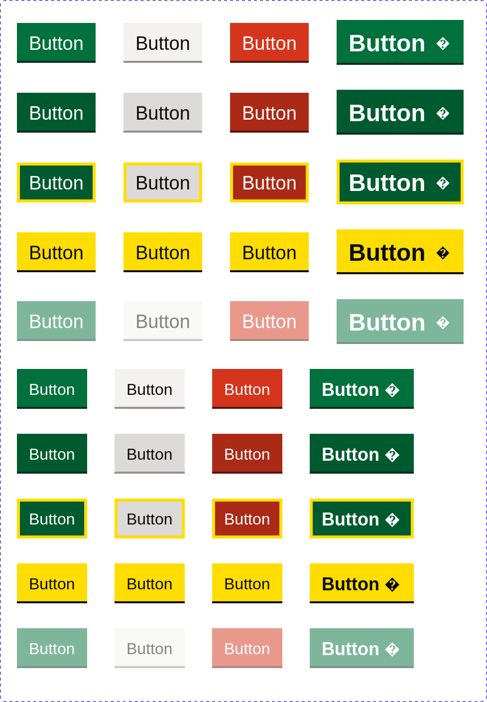

# Figma REST API HTML Generator

Generate HTML files from files fetched through the
[Figma REST API](https://www.figma.com/developers/api).

## Example output discussed

[example](../../example-figma-files/gov-uk-design-system-components/button.html)



```html
<div
  style="
    background: #00703c;
    flex-direction: column;
    justify-content: center;
    align-items: center;
    padding: 8px 12px 7px;
    line-height: 0;
    display: flex;
    position: absolute;
    top: 23px;
    left: 17px;
    box-shadow: inset 0 -2px #002d18;
  "
  data-figma-name="Viewport=Desktop, Type=Primary, Hover=False, Focus=False, Disabled=False"
  data-figma-id="1:19"
>
  <div
    style="
      color: #fff;
      font-family: GDS Transport Website;
      font-size: 19px;
      font-weight: 300;
      line-height: 25px;
    "
    data-figma-name="Content: Text"
    data-figma-id="1:9"
  >
    Button
  </div>
</div>
```

The CSS used to format the HTML is inline on each HTML tag. No attempt is yet
made to use CSS stylesheets or assign helpers like CSS classes.

Some absolute positioning and absolute sizing is used where it can't be avoided.
Using
[auto-layout](https://help.figma.com/hc/en-us/articles/5731482952599-Using-auto-layout)
mostly prevents that as it gets converted to flex-box. In the example above
absolute positioning is used to position the outer `<div>` as the component-set
itself doesn't use auto-layout.

The HTML maps directly to nodes within Figma. A deeply nested Figma design will
generate deeply nested html.

No fallback fonts are specified.

Vectors are replaced by an SVG placeholder.

Semantic HTML elements aren't used. Everything is a `<div>` or `<svg>` (for
vectors). Component appropriate elements like `<button>` or `<input>` are not
used.

## Direction

I'm undecided to if this is going to be:

- A general purpose HTML generator.
- A generator designed to adapt to peculiarities of a few designs (for example
  ones I use at work).
- A tool designed to be flexible with lots of configuration.
- An inspiration from which other generators can be built. These could even in
  other languages like TypeScript since I generate types.

## Usage

```bash
cargo run --release -- to-html 213:6 < example-figma-files/gov-uk-design-system.json > example-figma-files/gov-uk-design-system-components/button.html
```

You can get the node id from the URL when using the web-ui.


The HTML can be piped through additional commands to add fallback fonts and to
format the HTML.

```bash
cargo run --release -- to-html 213:6 < example-figma-files/gov-uk-design-system.json \
	| sed 's/font-family: GDS Transport Website;/font-family: GDS Transport Website,arial,sans-serif;/g' \
	| npx prettier@2.8.4 --parser html > example-figma-files/gov-uk-design-system-components/button.html
```
